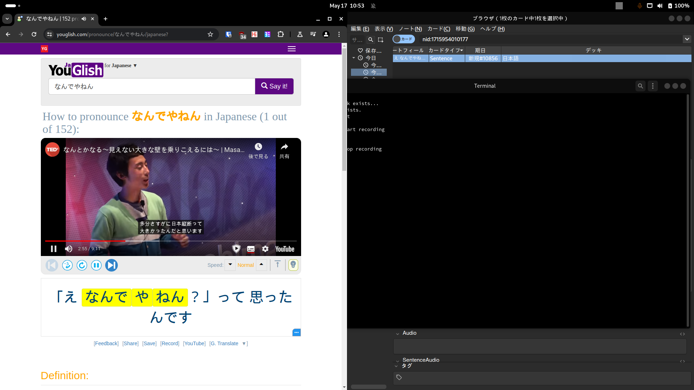
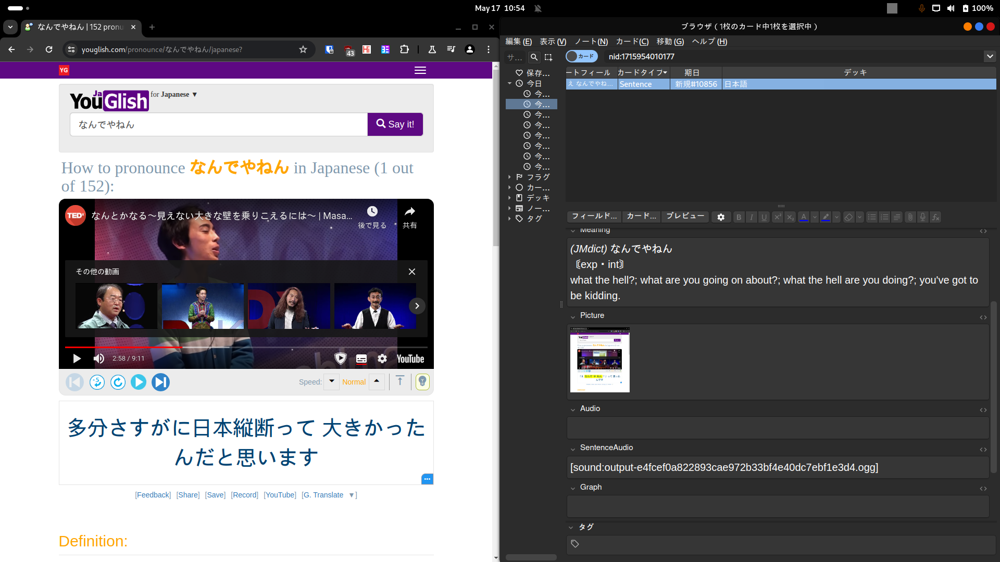
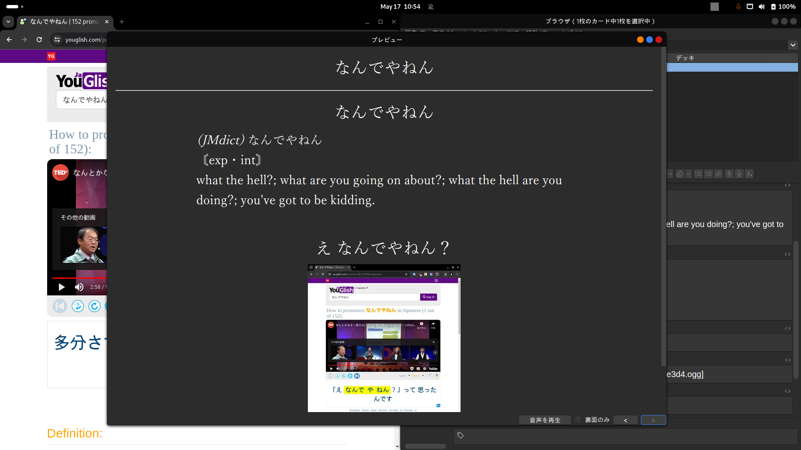

# idk
i created this tool to automate the process of creating new japanese vocab cards in Anki using mainly visual novels, that's why it records audio and takes a screenshot. In the end, i decided to just dualboot windows anyway so i can use Yomitan to add new cards to anki, Textractor to hook the texts from the game and ShareX to screenshot and record audio. Maybe i will update this to use with other things like youglish idk

## requisites
probably only works on my enviroment sry (arch linux, pipewire-pulse, gnome, xorg)
libraries used are in requirements.txt

pls check scripts/settings.py for configuration

you need to add a audio loopback device and set it as default, check out setup.py in utils to see it how I do it

## example
* First create a card with yomitan

* The app is running, so just press RIGHT SHIFT to record the system's audio

* Press RIGHT SHIFT again to stop recording

* After that, audio and screenshot are attached to the most recent created note

* This is the final result. I know that screenshot should not be like this, but this app was manly develop for using with visual novels, so that's why it screenshots all the window region
